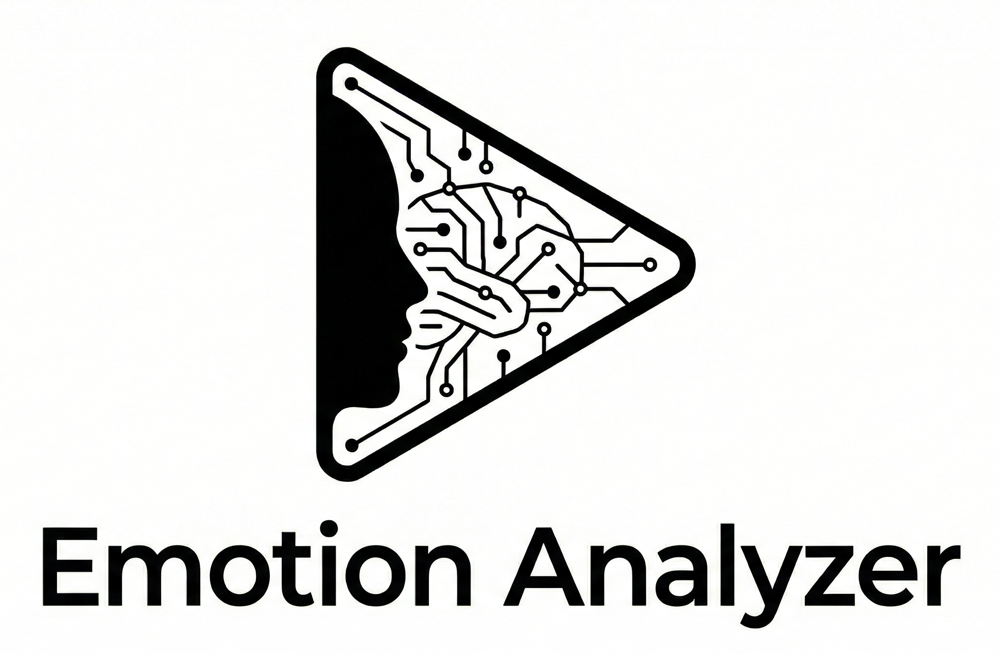
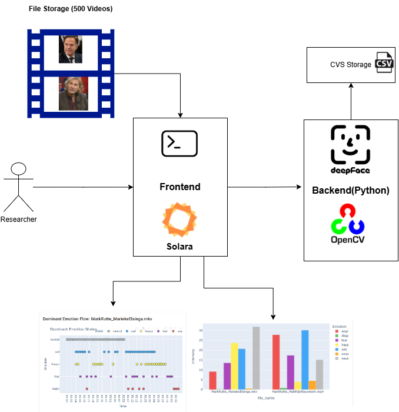
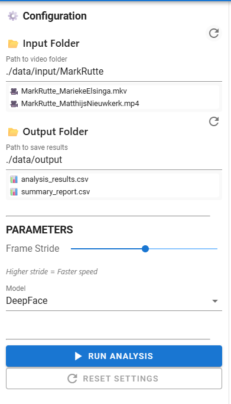
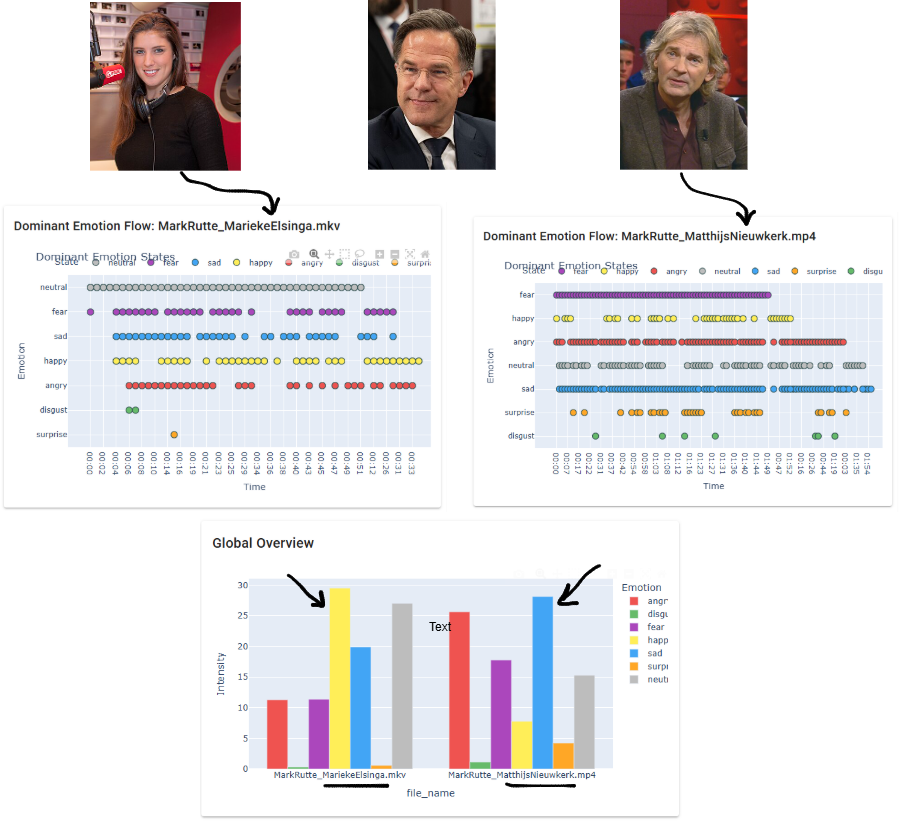

# TV Show Emotion Analyzer (EmoVision)

EmoVision is an AI-powered (DeepFace with current version) analytical tool designed to support media studies research. It processes video archives to detect, quantify, and visualize the emotional responses of talk show hosts and guests, supporting data-driven validation of research hypotheses.

This tool helps to answer: **"Do certain talk show hosts elicit increased emotional responses?"**


<!-- <div style="text-align: center;">
  
</div> -->

## The Problem

A researcher needs to analyze emotional responses in TV show content across hundreds of videos (e.g 500). Analyzing manually all videos is time-consuming and impractical. his tool automates emotion detection and generates report and statistics.

## The Solution

Well, the solution to the above problem is to build an automation tool that can detect emotions from video frames using AI models and commputer vision libraries. The tool should be able to process multiple videos in a batch, extract frames at regular intervals (configurable by the user), analyze the emotions displayed in those frames, and then compile the results into a structured format (like CSV) for further analysis.

<div style="text-align: center;">
  
</div>

### A high-level workflow of the tool:

-   **Input**: Folder of videos (MP4, AVI, MOV, MKV)
-   **Process**: Extract frames → Detect faces → Analyze emotions (DeepFace) → Aggregate results
-   **Output**: CSV spreadsheets + statistical reports (in the web UI) 

---

## Installation & Usage

### Prerequisites
Make sure Docker Desktop is installed and running.

### Option 1: `run.sh` Script (Pre-built image from Docker Hub)
1. First download the `run.sh` script from the repository, then run: 
```bash
bash run.sh
```
2. Open your web browser and navigate to:  http://localhost:8765
3. Place your video files into the `data/inputs` folder.

### Option 2: Docker Compose
1. Clone the repository and navigate to the project folder.
2. Place your video files into the `data/inputs` folder.
3. Run the following command in your terminal:
```bash
docker-compose up --build
```
### Short Manual (For web UI access) 
Once the tool is running and you have accessed the web UI, you can configure the tool with few parameters: 

<div style="text-align: center;">
  
</div>

1. **Input Path**: Path to the folder containing input videos (default: `./data/input`). Feel free to create subfolders for specific guest you want to analyze (e.g., `./data/input/MarkRutte`). Click the refresh icon next to the folder title to re-scan the directory if you added new files.

2. **Output Path**: Path to the folder where results will be saved (default: `./data/output`).

3. **Frame Interval (Stride)**: Analyze every Nth frame (default: 25, which is approximately 1 frame per second for 25 FPS videos). Lower values yield more data but increase processing time hence slow. Higher values speed up processing but may miss short emotional expressions.

4. **Model Selection**: Currently only DeepFace is supported. More models will be added in future releases as plugins. This way the tool can be easily extended to support new models without changing the core logic.


### Demo
For this demo, I have analyzed Mark Rutte's appearances on Dutch talk shows. In the first video, Mark Rutte is on Matthijs van Nieuwkerk's talk show. Matthijs is know for his direct and sometimes confrontational interviewing style. In the second video, Mark Rutte appears on Marieke Elsing's talk show. Marieke is known for her conversational approach.

<div style="text-align: center;">
  
</div>

As we can see from the emotion timelines, Matthijs' interview style seems to elicit stronger emotional reactions from Mark Rutte, with more frequent spikes in emotions like anger, fear and sad. In contrast, Marieke's conversational approach appears to result in a calmer and with emotions like happiness and neutral being more dominant.

Note: Yellow: Happiness, Red: Anger, Blue: Sad, Purple: Fear, Grey: Neutral, Green: Disgust, Orange: Surprise

I have used `yt-dlp` to download the videos from YouTube.
```bash
yt-dlp --download-sections "5:20-18:45" "https://www.youtube.com/watch?v=abc123"
``` 
Desclaimer: These videos and the tool (`yt-dlp`) are used solely for demonstration purposes within this project and are not intended for redistribution or advocating the tool.

### Report Output
The tool generates two main CSV reports in the output folder:
1. `analysis_results.csv`: Contains frame-by-frame emotion data for each video.

| file_name  | timestamp | frame_index | dominant_emotion | happy | sad  | angry | ... |
| ---------- | --------- | ----------- | ---------------- | ----- | ---- | ----- | --- |
| video1.mp4 | 00:01:05  | 25          | happy            | 0.82  | 0.03 | 0.01  | ... |
| video1.mp4 | 00:01:06  | 26          | sad              | 0.10  | 0.70 | 0.05  | ... |
| video2.mp4 | 00:02:15  | 54          | angry            | 0.05  | 0.10 | 0.75  | ... |
| video2.mp4 | 00:02:16  | 55          | neutral          | 0.20  | 0.15 | 0.10  | ... |


2. `summary_report.csv`: Provides high-level statistics per video, including dominant emotions and their percentages.

| video_name | total_frames | dominant_emotion | happy_pct | sad_pct | ... |
| ---------- | ------------ | ---------------- | --------- | ------- | --- |
| video1.mp4 | 120          | happy            | 45.2      | 12.1    | ... |

## Developer Guide (Extending the Tool)
This project follows Clean Architecture principles with a bit tweak. For more information, see the [Uncle Bob](https://blog.cleancoder.com/uncle-bob/2012/08/13/the-clean-architecture.html)

**Why Clean Architecture?**

-   Very easy to communicate with other developers. 
-   Enforce clear separation of concerns (S from SOLID).
-   Test layers independently.
-   These are few but there are many more benefits.  

## Maping the source code to Clean Architecture layers

```

┌─────────────────────────────────────────────────────────┐
│   Presentation           |   Infrastructure             │
│   (CLI / Solara Web UI)  |  (DeepFaceAnalyzer, e.t.c)   │
├─────────────────────────────────────────────────────────┤
│                    Application                          │
│         (EmotionAnalyzer, StatisticsService)       │
├─────────────────────────────────────────────────────────┤
│                      Domain                             │
│          (EmotionResult, VideoFrame, Interfaces)        │
└─────────────────────────────────────────────────────────┘
```
### How does the above architecture map to the codebase?

```
tvshow-emotion-analyzer/
├── backend/
│   └── src/                  # src can be removed 
│       ├── domain/           # Core entities & interfaces
│       ├── application/      # Use cases & Main logic
│       ├── infrastructure/   # DeepFace, OpenCV, CSV storage
│       └── presentation/     # CLI entry point
├── frontend/                 # This is also part of presentation layer
│   ├── app.py               # Solara web UI
│   ├── components/          # Dashboard, Sidebar, Console
│   └── state/               # Reactive state management
├── data/
│   ├── input/               # Place videos here
│   └── output/              # Results saved here
└── docker-compose.yml
```

### Local Setup ( For developers)
1. Clone the project repository
2. Setup a virtual environment and install dependencies:
```bash 
python -m venv venv
source venv/bin/activate  # or venv\Scripts\activate on Windows
pip install -r requirements.txt
```
3. Run the Solara web UI locally:
```bash
python -m solara run frontend/app.py
# python -m is needed to ensure the src/ is in PYTHONPATH. Otherswise, you may get ModuleNotFoundError.
```
### Workflow collaboration and Contribution
4. Create a new branch for your feature or bug fix. E.g `git checkout -b feat/multimodal`.
5. Extend the code following the established architecture.
6. Write unit tests. 
7. Run the quality check script for formatting (YAPF), imports (isort), style (Flake8), and types (Mypy).
```bash 
# Run check script (Windows)
.\check_qlty.ps1

# Run check script (Unix / VS-Cod bash / WSL2)
./check_qlty.sh

# If you want to run only the tests
pytest

# OR with coverage
pytest --cov=backend/src --cov-report=html backend/tests/
```

## Work Process

### Design Decisions (Technology Choices)
---
This section details the design choices and technology choices made during the development.
### Design Decisions 
**Modularity and Clean Code**: In the implementation, priority is given for modularity and clean code. 
- Reasoning: Maintainability, extensibility, and readability for future of me and other develoeprs

**Using OOP Principles**: Try to apply OOP concepts to model real world entities and behaviors. For example, Video and Frame class are created. Video represents a video file and Frame represents a single frame within that video. 
- Reasoning: Encapsulation of data and behavior, code reusability, and easier debugging.

**Multi Phase Processing Pipeline**: Adopted a two-pass approach (but more phase can be added in the future), collecting statistics after video processing.
- Reasoning: Isolates heavy AI processing from aggregation logic, preventing simple reporting errors from crashing long-running jobs.

**Centralized Logging**: Implemented a unified logging system capturing events across all modules.
- Reasoning: Simplifies debugging and monitoring by aggregating logs from different components into one stream.

**Web UI (Solara)**: For web ui Solara is selected over other ui framework like Reactjs and Streamlit. While reactjs is to much for this project and Streamlit is not flexible enough especially for layout and custom components.
- Reasoning: Solara is reactive and component-based, support easy to use state management, support FastAPI integration if required perhaps in the future, No html, CSS, or JavaScript needed, and fast development cycle.


#### Technology Choices
I didn't face challenge in selecting technologies as the requirements were clear. However, I made few choices based on my prior experience and research. 
- **Pytest For Testing**: Exprienced in using pytest for unit testing in previous projects. Pytest offers a simple syntax, fixtures, easy of mocking external dependencies. 

- **Solara for Web UI**: I didn't have experience with Solara before. I did some research and found first Streamlit. However, I didn't find Streamlit flexible enough fto adjustlayout. Then did more search and found Solara. Few things I liked about Solara are: Component-Based, Reactive State Management, FastAPI Integration, and Python-Native (I can call Python code directly).


### Challenges Faced
---
- Adapting Clean Architecture for a small-scale MVP without overengineering it. 
- Extracting emotions from only the target guest (i.e. avoiding emotion noises from other audiences).
- Alignment between extracted emotion frames and original video timestamps. 
- Maintaining consistent code standards across modules and files.
- Selecting dashboard metrics type (like Heatmaps) that offer immediate value to the user.


### Limitations & Future Improvements
---
-  With current verssion, emotions are detected from all the faces in the frame. In future, we can add feature to select only the guest face (which is target) by uploading few images of the target.
- Only visual emotion detection is supported. Future versions could integrate audio-based emotion analysis capabilities.
- High processing time for large video datasets. Future versions could implement GPU acceleration or distributed processing.
- Data (result) is stored in CSV files. Improvement is required to integrate a database (SQL or NoSQL) for better data management and querying.
- The timestamp in the output CSV is not yet validated. 
- The researcher has no way of interactively querying the results. Future versions could integrate a chatbot interface powered by LLMs for interactive exploration of results.
- Modular Monlith architecture is used. However, decoupling the frontend (Solara) and backend with FastAPI is possible future direction. 

### Leasons Learned
---
- Logging every decision and challenge faced during development. 
- Starting small and make it bigger through iterations (MVP approach)
- The benefit of code quality tools in maintaining a clean codebase
- Simplicity is the ultimate sophistication.

